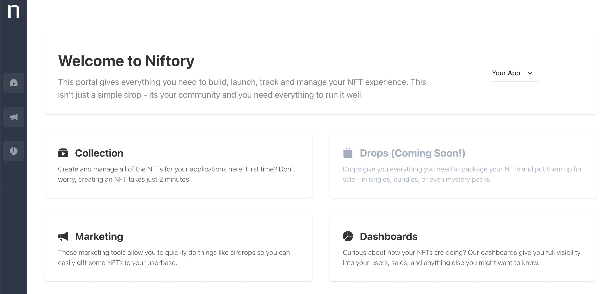

# What is Niftory?


[**Niftory**](https://niftory.com/) is a platform for building, launching, and tracking your web3 application. We provide APIs you need to easily add NFTs into your websites, apps, games and other experiences, without having to worry about smart contracts, gas fees or other esoteric blockchain infrastructure.\

Join our Discord to chat! [https://discord.com/invite/nZJYz3aJsk](https://discord.com/invite/nZJYz3aJsk)


Whether you are trying to build your own digital marketplace, experimenting with new use-cases we haven't even dreamt of, or simply trying to incorporate web3 concepts into your application, Niftory will turbo-charge your time-to-market by abstracting away blockchain complexity, so you can focus on iterating quickly - and building rich experiences for your customers.

## Platform Overview

The Niftory platform consists of two core products:&#x20;

### [**Niftory web3 API**](http://127.0.0.1:5000/o/ShoAj2x7X0erlYafyocL/s/1itXKRjyFqqWGYkUXFnP/)

The Niftory API gives developers everything they need to launch a new Web3 experience, without having to think about the blockchain or any complex infrastructure setup. You simply interact with easy-to-use GraphQL APIs that handle everything from creating custodial wallets, querying, minting and transferring tokens, and much more.


**What makes the Niftory API unique?** We run a full Web2 + Web3 infrastructure stack for you, and expose both on-chain and off-chain resources in a unified API.

This means you can store your content and application metadata on scalable cloud resources (such as [Amazon S3](https://aws.amazon.com/s3/) and [Serverless](https://aws.amazon.com/rds/aurora/serverless/)), and on-chain metadata and content on permanent web3 storage like [IPFS](https://ipfs.io/), enabling you to build a performant web3 experience.&#x20;

Learn more in the [**Why Niftory** ](https://docs.niftory.com/docs/#core-capabilities)section.


### [**Niftory Admin Portal**](http://127.0.0.1:5000/o/ShoAj2x7X0erlYafyocL/s/Z0zX8NOUJGEW56P5Ijke/)

The [Admin Portal](https://admin.niftory.com/) is your developer dashboard to manage your application. This is where you deploy your smart contract, get your API keys, manage your team, design NFTs, and track how your app is doing as users interact with your NFTs.

[**Sign up for Niftory today and get your API keys to get started.**](https://admin.niftory.com)

